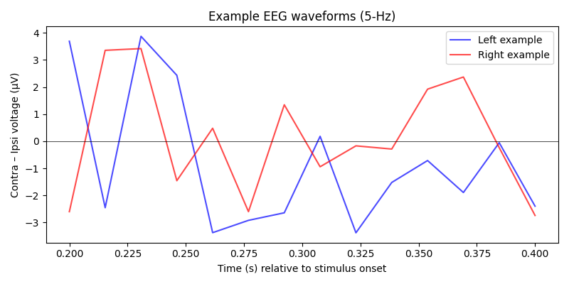
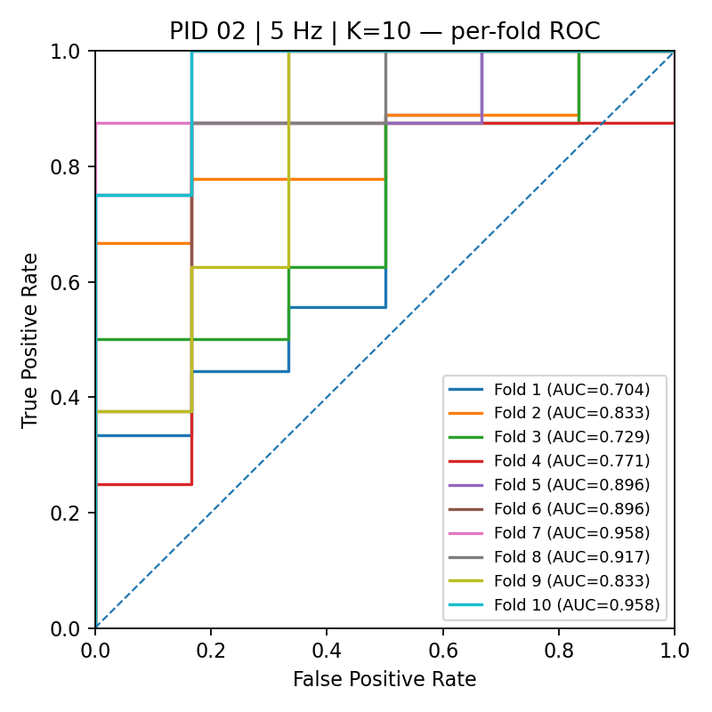
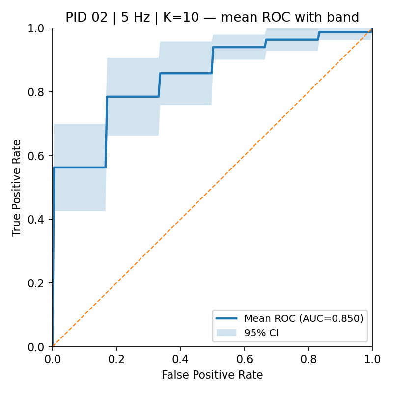

# EEG-BCI-Target-Classification
EEG BCI project for single-trial left vs right target classification.

# EEG-BCI-Target-Classification

This repository contains a reproduction of EEG-based **single-trial left vs right target classification** experiments, based on the paper:

> Matran-Fernandez, A., & Poli, R. (2017).  
> *Towards the automated localisation of targets in rapid image-sifting by collaborative brain-computer interfaces*.  
> PLoS ONE 12(5): e0178498. [https://doi.org/10.1371/journal.pone.0178498](https://doi.org/10.1371/journal.pone.0178498)

---

## 📑 Overview
The project focuses on detecting the **N2pc Event-Related Potential (ERP)** from EEG signals to classify whether a visual target appeared on the **left** or **right** side of the screen.  
The dataset used is the [LTRSVP dataset from PhysioNet](https://physionet.org/physiobank/database/ltrsvp/).

---

## 🧠 Methods

### 1. Data Preprocessing
- Band-pass filtering (0.15–28 Hz).  
- Downsampling to 64 Hz.  
- Artifact removal (eye blinks and movements).  
- Epoch extraction: 200–400 ms after stimulus onset (where N2pc is expected).  

### 2. Feature Extraction
- Selected electrode differences:  
  - PO7–PO8  
  - P7–P8  
  - PO3–PO4  
  - O1–O2  
- Each epoch produced a feature vector of **56 values (14 time points × 4 channels)**.  
- Contralateral vs ipsilateral representation used for N2pc convention.  

### 3. Classification
- **Classifier**: Linear SVM.  
- **Validation**: Double cross-validation setup:  
  - Outer loop: 75/25 train/test split, repeated 10 times.  
  - Inner loop: 10-fold stratified CV to tune SVM `C` parameter.  
- **Evaluation Metric**: AUC (Area Under ROC Curve).  

### 4. Results
- Single-user BCIs achieved median AUC ≈ **0.75**.  
- Some participants reached AUC ≥ 0.80 (good single-trial classification).  
- Results are consistent with findings in the original paper.  

---
## 📊 Results

This project reproduces **single-trial N2pc left-vs-right classification** on the LTRSVP dataset using fixed 10-fold nested cross-validation, following the original paper.

### Group-level Performance
- **5 Hz**: mean AUC = **0.789**, median AUC = 0.803  
- **6 Hz**: mean AUC = **0.750**, median AUC = 0.772  
- **10 Hz**: mean AUC = **0.731**, median AUC = 0.679  

Overall, classification performance was highest at **5 Hz**, and decreased slightly at higher stimulus rates.

| Rate (Hz) | Participants | Mean AUC | Median AUC | Std | Min | Max |
|-----------|--------------|----------|------------|-----|-----|-----|
| 5 Hz      | 11           | 0.789    | 0.803      | 0.064 | 0.679 | 0.881 |
| 6 Hz      | 11           | 0.750    | 0.772      | 0.132 | 0.513 | 0.901 |
| 10 Hz     | 10           | 0.731    | 0.679      | 0.144 | 0.512 | 0.957 |

---

### Participant-level Performance
Average AUC per participant and rate:

| PID | 5 Hz | 6 Hz | 10 Hz |
|-----|------|------|-------|
| 2   | 0.842 | 0.772 | 0.618 |
| 3   | 0.803 | 0.743 | 0.666 |
| 4   | 0.850 | 0.901 | 0.861 |
| 6   | 0.786 | 0.817 | 0.877 |
| 8   | 0.821 | 0.722 | 0.692 |
| 9   | 0.757 | 0.538 | 0.653 |
| 10  | 0.693 | 0.688 | 0.629 |
| 11  | 0.743 | 0.781 | 0.850 |
| 12  | 0.881 | 0.881 | 0.957 |
| 13  | 0.679 | 0.513 | 0.512 |
| 14  | 0.819 | 0.899 | — |

---

### Cross-validation Consistency
Inner-CV vs outer test AUCs (mean ± SD):

- Median inner-CV AUCs:  
  - 5 Hz = **0.83**  
  - 6 Hz = **0.79**  
  - 10 Hz = **0.70**  
- Median outer test AUCs:  
  - 5 Hz = **0.80**  
  - 6 Hz = **0.77**  
  - 10 Hz = **0.68**  
- Statistical comparison: inner vs outer means differ significantly at 5 Hz and 6 Hz (p=0.04), but not at 10 Hz (p=0.08).  

---

### Between-rate Statistics
- Friedman test (n=10 participants, comparing 5, 6, 10 Hz):  
  χ² = 1.40, p = 0.497 → **no significant difference** between rates.  
- Post-hoc Wilcoxon (Holm correction):  
  - 5 vs 6 Hz: p = 0.39  
  - 5 vs 10 Hz: p = 0.39  
  - 6 vs 10 Hz: p = 1.0  

Conclusion: although 5 Hz tends to give slightly higher AUCs, **no frequency condition was significantly better** than the others statistically.

---

### Example Figures
### EEG Waveforms (N2pc Component)
The figure below shows example EEG waveforms at **5 Hz**, extracted from the contra–ipsi electrode differences.  
- **Blue**: Left visual field (LVF) targets  
- **Red**: Right visual field (RVF) targets  

The N2pc component is a well-known ERP marker of **spatial attention**, typically appearing around **200–300 ms** after stimulus onset.  
In this project, we focus on the 200–400 ms window, where contra–ipsi differences over posterior electrodes (PO7–PO8, P7–P8, PO3–PO4, O1–O2) are strongest.  
These features serve as the basis for single-trial classification.




Below are example results for **Participant 02** at **5 Hz** stimulation rate.  

### Per-Fold ROC
Each colored line represents one fold of a 10-fold cross-validation.  
AUC values range from ~0.70 to ~0.96, showing variability across folds but overall good performance.



### Mean ROC with 95% Confidence Interval
The figure below shows the averaged ROC curve with a 95% confidence band across folds.  
The mean AUC is **0.850**, which is consistent with results reported in the original study.



---

## 📚 Analysis

In our replication, we observed that the amplitude of the N2pc component decreased as the presentation rate increased, with the peak amplitude at 10 Hz being significantly smaller than at 5 and 6 Hz. Since the N2pc provides the main discriminative neural signal for distinguishing left- versus right-sided targets, a reduction in its amplitude directly limits the separability of classes and contributes to a lower classification performance.

The single-user AUC medians were 0.77, 0.77, and 0.72 for 5, 6, and 10 Hz, respectively. Although these differences were not statistically significant, the decreasing trend is consistent with the ERP results.

The attenuation of the N2pc at higher rates can be attributed to several non-exclusive factors discussed in the original study:

1. Increased task difficulty – At higher presentation rates, targets are displayed for a shorter duration, making detection harder. This was reflected in the larger number of missed airplanes reported by participants at 10 Hz.

2. Refractory phenomena ruled out – A possible refractory period related to repetition blindness or the attentional blink was tested but not supported by the data, as N2pc amplitudes were not significantly bigger for well-separated targets compared to closely spaced targets (p = 0.27).

3. Fatigue and order effects – Because the conditions were not randomized, the fastest (10 Hz) blocks occurred later in the experiment, when participants were likely more tired and less attentive.

Taken together, these results indicate that the decline in classification performance with increasing frequency is primarily explained by increased task difficulty and fatigue effects, rather than by refractory phenomena.


---
### Summary
- Reproduced the original paper’s finding that **single-trial left-vs-right classification is feasible** with N2pc features.  
- Median single-user performance reached **AUC ~0.80 at 5 Hz**, with some participants achieving **>0.90**.  
- Performance was lower at higher rates (6 and 10 Hz), but differences were **not statistically significant**.  
- Results confirm the robustness of the N2pc marker for spatial attention and its utility in BCI classification tasks.

---

## 📂 Project Structure
```
EEG-BCI-Target-Classification/
├── data/ # (empty) dataset must be downloaded from PhysioNet
│ └── README.md # instructions for dataset placement
├── explore_dataset/ # scripts for exploring and visualizing EEG data
├── results/ # representative figures (ROC, confusion matrix, ERP)
├── src/ # main source code
│ ├── main.py # run classification (single-trial left vs right)
│ ├── new_main_ROC.py # generate ROC curves
│ ├── Friedman_test.py # Friedman statistical test
│ ├── Wilcoxon_signed-rank_test_Bonferroni.py # Wilcoxon test with correction
│ └── roc.py # script to generate ROC with confidence bands
├── requirements.txt # dependencies
└── README.md # project documentation
```
---

## 🔗 Reference

Matran-Fernandez, A., & Poli, R. (2017).
Towards the automated localisation of targets in rapid image-sifting by collaborative brain-computer interfaces.
PLoS ONE 12(5): e0178498. https://doi.org/10.1371/journal.pone.0178498
