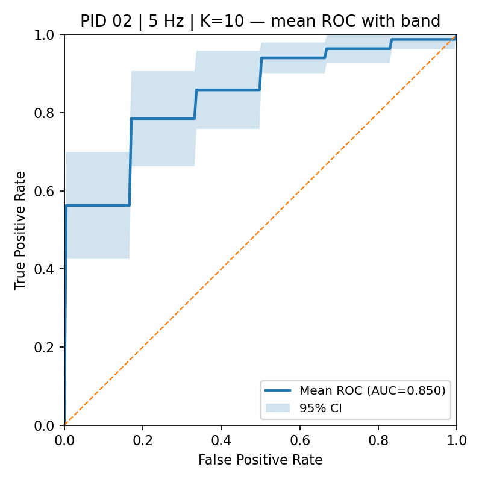

# EEG-BCI-Target-Classification
EEG BCI project for single-trial left vs right target classification.

# EEG-BCI-Target-Classification

This repository contains a reproduction of EEG-based **single-trial left vs right target classification** experiments, based on the paper:

> Matran-Fernandez, A., & Poli, R. (2017).  
> *Towards the automated localisation of targets in rapid image-sifting by collaborative brain-computer interfaces*.  
> PLoS ONE 12(5): e0178498. [https://doi.org/10.1371/journal.pone.0178498](https://doi.org/10.1371/journal.pone.0178498)

---

## 📑 Overview
The project focuses on detecting the **N2pc Event-Related Potential (ERP)** from EEG signals to classify whether a visual target appeared on the **left** or **right** side of the screen.  
The dataset used is the [LTRSVP dataset from PhysioNet](https://physionet.org/physiobank/database/ltrsvp/).

---

## 🧠 Methods

### 1. Data Preprocessing
- Band-pass filtering (0.15–28 Hz).  
- Downsampling to 64 Hz.  
- Artifact removal (eye blinks and movements).  
- Epoch extraction: 200–400 ms after stimulus onset (where N2pc is expected).  

### 2. Feature Extraction
- Selected electrode differences:  
  - PO7–PO8  
  - P7–P8  
  - PO3–PO4  
  - O1–O2  
- Each epoch produced a feature vector of **56 values (14 time points × 4 channels)**.  
- Contralateral vs ipsilateral representation used for N2pc convention.  

### 3. Classification
- **Classifier**: Linear SVM.  
- **Validation**: Double cross-validation setup:  
  - Outer loop: 75/25 train/test split, repeated 10 times.  
  - Inner loop: 10-fold stratified CV to tune SVM `C` parameter.  
- **Evaluation Metric**: AUC (Area Under ROC Curve).  

### 4. Results
- Single-user BCIs achieved median AUC ≈ **0.75**.  
- Some participants reached AUC ≥ 0.80 (good single-trial classification).  
- Results are consistent with findings in the original paper.  

---

## 📊 Example Results

Below are example results for **Participant 02** at **5 Hz** stimulation rate.  

### Per-Fold ROC
Each colored line represents one fold of a 10-fold cross-validation.  
AUC values range from ~0.70 to ~0.96, showing variability across folds but overall good performance.



### Mean ROC with 95% Confidence Interval
The figure below shows the averaged ROC curve with a 95% confidence band across folds.  
The mean AUC is **0.850**, which is consistent with results reported in the original study.


Summary of classification performance across participants (AUC):


ERP waveform (N2pc component):


---

## 📂 Project Structure
```
EEG-BCI-Target-Classification/
├── data/ # (empty) dataset must be downloaded from PhysioNet
│ └── README.md # instructions for dataset placement
├── explore_dataset/ # scripts for exploring and visualizing EEG data
├── results/ # representative figures (ROC, confusion matrix, ERP)
├── src/ # main source code
│ ├── main.py # run classification (single-trial left vs right)
│ ├── new_main_ROC.py # generate ROC curves
│ ├── Friedman_test.py # Friedman statistical test
│ ├── Wilcoxon_signed-rank_test_Bonferroni.py # Wilcoxon test with correction
│ └── roc.py # script to generate ROC with confidence bands
├── requirements.txt # dependencies
└── README.md # project documentation
```
---

## 🔗 Reference

Matran-Fernandez, A., & Poli, R. (2017).
Towards the automated localisation of targets in rapid image-sifting by collaborative brain-computer interfaces.
PLoS ONE 12(5): e0178498. https://doi.org/10.1371/journal.pone.0178498
